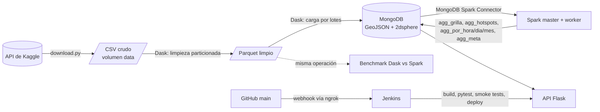

# Procesamiento geoespacial: Big Data con despliegue continuo

Sistema que obtiene un dataset de crímenes de Chicago con la **API de Kaggle**, lo limpia de forma distribuida con **Dask**, lo almacena en **MongoDB** como puntos GeoJSON con índice `2dsphere`, calcula agregaciones espaciales y temporales con **Spark** y expone consultas geoespaciales en una **API Flask**. Cada merge a `main` dispara un pipeline de **Jenkins** que construye, prueba y despliega todo automáticamente.

**Integrantes:** Miguel Ángel Pérez Martínez · Juan Pablo Ruiz Arizmendi
**Curso:** Big Data

---

## Dataset

| | |
| --- | --- |
| Nombre | Crimes In Chicago (2001 to 2023) |
| Kaggle | [`utkarshx27/crimes-2001-to-present`](https://www.kaggle.com/datasets/utkarshx27/crimes-2001-to-present) |
| Archivo | `Crimes_-_2001_to_Present.csv` (1.84 GB, ~7.8 millones de registros) |
| Columnas usadas | `Latitude`, `Longitude`, `Date`, `Case Number`, `Primary Type`, `Location Description` |
| Fuente original | Portal de datos de la Ciudad de Chicago |

El dataset se obtiene **siempre con la API de Kaggle** desde el script `ingest/download.py`, que Jenkins ejecuta en su etapa *Ingesta*. Ningún archivo del dataset se descarga a mano ni se sube al repositorio.

> El dataset `chicago/chicago-crime` de Kaggle es de tipo BigQuery y no tiene archivos descargables por la API; por eso se usa esta versión en CSV con los mismos datos.

---

## Arquitectura



| Servicio | Imagen | Rol | Puerto en el host |
| --- | --- | --- | --- |
| `mongo` | `mongo:7.0` | Base de datos con índice 2dsphere | 27017 |
| `dask-scheduler` | `geo/dask` | Reparte las tareas de Dask | 8787 (panel) |
| `dask-worker` ×2 | `geo/dask` | Ejecutan la limpieza y la carga | — |
| `ingest` | `geo/dask` | Trabajo: API de Kaggle → limpieza → MongoDB | — |
| `spark-master` | `geo/spark` | Coordina Spark y ejecuta el driver | 8081 (panel) |
| `spark-worker` | `geo/spark` | Ejecuta las agregaciones | — |
| `api` | `geo/api` | API Flask servida con gunicorn | 5000 |
| `jenkins` | `jenkins/` (compose aparte) | CI/CD | 8080 |

Jenkins vive en `jenkins/docker-compose.yml`, separado del sistema, para que el pipeline no se recree a sí mismo durante un despliegue.

---

## Estructura del repositorio

```
├── docker-compose.yml        # sistema completo
├── config.env                # configuración del dataset (no secreta)
├── .env.example              # plantilla de secretos (el .env real NO se versiona)
├── Jenkinsfile               # pipeline CI/CD
├── jenkins/                  # imagen y compose de Jenkins
├── ingest/                   # Dask: download.py, clean_load.py, bench_dask.py
├── spark/jobs/               # Spark: aggregations.py, bench_spark.py
├── api/                      # Flask: app.py, validators.py y pruebas
├── scripts/                  # run_spark.sh, benchmark.sh, resumen_bench.py
└── docs/                     # informe técnico
```

---

## Requisitos

- Docker Desktop con Compose v2 (en Windows, con WSL 2) y **al menos 8 GB de RAM asignados a Docker**.
- Git. En Windows, usar **Git Bash** como terminal.
- Una cuenta de Kaggle con un **API token** (Settings → API → *Generate New Token*, empieza por `KGAT_`).
- Para el webhook: una cuenta de ngrok con dominio estático.

**Solo en Windows con Git Bash**, ejecutar una vez y reabrir la terminal. Evita que Git Bash convierta rutas como `/data/raw` en rutas de Windows:

```bash
setx MSYS_NO_PATHCONV 1
```

---

## Configuración

### Secretos: `.env` (no se sube a GitHub)

```bash
cp .env.example .env
```

| Variable | Valor |
| --- | --- |
| `MONGO_USER` | `admin` |
| `MONGO_PASSWORD` | Contraseña de MongoDB, sin caracteres especiales (`@ : / ? #`) |
| `KAGGLE_API_TOKEN` | Token de la API de Kaggle (`KGAT_...`) |

### Dataset: `config.env` (sí se versiona)

| Variable | Valor | Para qué |
| --- | --- | --- |
| `KAGGLE_DATASET` | `utkarshx27/crimes-2001-to-present` | Dataset que se pide a la API |
| `CSV_GLOB` | `/data/raw/*.csv` | Archivos a leer |
| `LAT_COL` / `LON_COL` / `TIME_COL` | `Latitude` / `Longitude` / `Date` | Columnas de coordenadas y fecha |
| `TIME_FORMAT` | `%m/%d/%Y %I:%M:%S %p` | Formato de las fechas (`09/05/2015 01:30:00 PM`) |
| `KEEP_COLS` | `Case Number, Primary Type, Location Description` | Columnas adicionales que se conservan |
| `BBOX` | `-88.0,41.6,-87.5,42.1` | Caja geográfica de Chicago; lo que cae fuera se descarta |
| `MAX_PARTITIONS` | TODO: valor usado | Particiones de ~64 MB a procesar (vacío = dataset completo) |

---

## Levantar el sistema desde cero

```bash
git clone https://github.com/Angelito-148/procesamiento_geoespacial.git
cd procesamiento_geoespacial
cp .env.example .env              # editar con los valores reales
docker compose up -d --build      # levanta Mongo, Dask, Spark y la API
docker compose ps                 # mongo y api deben quedar "healthy"
```

### Primera carga de datos

En el flujo oficial la ejecuta Jenkins (*Build with Parameters* → `RUN_INGEST` y `RUN_SPARK`). Para hacerla a mano:

```bash
set -a; source .env; set +a                          # carga el token en la terminal
docker compose run --rm -e KAGGLE_API_TOKEN ingest   # API de Kaggle → Dask → MongoDB
bash scripts/run_spark.sh                            # agregaciones con Spark
```

La descarga es idempotente: si el dataset ya está en el volumen, `download.py` la omite. El reporte de limpieza queda en `/data/reportes/limpieza.json`:

```bash
docker compose run --rm ingest cat /data/reportes/limpieza.json
```

### Verificar

```bash
curl "http://localhost:5000/health"     # {"estado": "ok"}
```

| Interfaz | Dirección |
| --- | --- |
| API | http://localhost:5000 |
| Panel de Dask | http://localhost:8787 |
| Panel de Spark | http://localhost:8081 |
| Jenkins | http://localhost:8080 |
| MongoDB Compass | `mongodb://admin:<MONGO_PASSWORD>@localhost:27017/?authSource=admin` |

Si el puerto 5000 está ocupado en Windows, agregar `API_PORT=5001` al `.env` y usar `localhost:5001`.

---

## Procesamiento

### Limpieza con Dask (`ingest/clean_load.py`)

El CSV se lee en particiones de 64 MB que procesan los workers en paralelo. Cada registro descartado cuenta en una sola regla:

| Regla | Motivo |
| --- | --- |
| Latitud o longitud nula o no numérica | Sin coordenadas no hay punto GeoJSON |
| Fuera de rango (lat ∉ [-90, 90], lon ∉ [-180, 180]) | Geometría inválida: el índice 2dsphere no se puede crear |
| Punto (0, 0) | Valor de relleno |
| Fuera de la caja geográfica de Chicago | Error de captura |
| Fecha nula o con formato inválido | Necesaria para las agregaciones temporales |

Los registros válidos se guardan como Parquet y se cargan a MongoDB por lotes de 5 000 documentos con el formato `location: { type: "Point", coordinates: [lon, lat] }`. Se crean los índices `location_2dsphere` y `ts_1`. La carga es idempotente: la colección se reemplaza en cada ejecución.

### Agregaciones con Spark (`spark/jobs/aggregations.py`)

Spark lee la colección `eventos` con el MongoDB Spark Connector 10.4 y escribe:

| Colección | Contenido |
| --- | --- |
| `agg_grilla` | Conteo por celda de 0.01° (~1.1 km), con el centro de la celda como GeoJSON |
| `agg_hotspots` | Celdas en el percentil 99 de conteo |
| `agg_por_hora` / `agg_por_dia` / `agg_por_mes` | Conteos temporales (hora local de Chicago) |
| `agg_meta` | Verificación: total de eventos = suma de la grilla (`cuadra: true`) |

---

## API

| Método | Ruta | Consulta MongoDB |
| --- | --- | --- |
| GET | `/health` | `ping` |
| GET | `/api/cercanos?lat=&lon=&radio=&limite=` | `$near` (radio en metros) |
| POST | `/api/poligono?limite=` (cuerpo: GeoJSON Polygon) | `$geoWithin` |
| GET | `/api/resumen-cercania?lat=&lon=&radio=` | agregación con `$geoNear` |
| GET | `/api/estadisticas/<grilla\|hotspots\|hora\|dia\|mes\|meta>` | resultados de Spark |

```bash
curl "http://localhost:5000/api/cercanos?lat=41.88&lon=-87.63&radio=500&limite=5"
curl "http://localhost:5000/api/resumen-cercania?lat=41.88&lon=-87.63&radio=1000"
curl "http://localhost:5000/api/estadisticas/hotspots?limite=5"
curl -X POST "http://localhost:5000/api/poligono?limite=5" \
  -H "Content-Type: application/json" \
  -d '{"type":"Polygon","coordinates":[[[-87.64,41.87],[-87.62,41.87],[-87.62,41.89],[-87.64,41.89],[-87.64,41.87]]]}'
```

Los parámetros inválidos responden `400` con un mensaje claro. GeoJSON usa el orden `[longitud, latitud]` y el polígono debe cerrarse.

---

## Pruebas

```bash
docker compose run --rm --no-deps api pytest -q      # 16 pruebas unitarias, sin MongoDB
```

Las pruebas de humo (`api/tests/smoke.py`) llaman a cada endpoint sobre un entorno aislado con datos sembrados por `api/tests/seed.py`. Jenkins las ejecuta automáticamente antes de desplegar.

---

## CI/CD con Jenkins

### Puesta en marcha

```bash
docker compose -f jenkins/docker-compose.yml up -d --build
docker compose -f jenkins/docker-compose.yml exec jenkins cat /var/jenkins_home/secrets/initialAdminPassword
```

1. Abrir http://localhost:8080, instalar los plugins sugeridos y crear el usuario administrador.
2. **Manage Jenkins → Credentials → System → Global** → crear dos credenciales de tipo *Secret text*:

   | ID | Valor |
   | --- | --- |
   | `mongo-password` | El mismo `MONGO_PASSWORD` del `.env` |
   | `kaggle-api-token` | El token de Kaggle (`KGAT_...`) |

3. **New Item** → *Pipeline* → *Pipeline script from SCM* → Git → `https://github.com/Angelito-148/procesamiento_geoespacial.git`, rama `*/main`, *Script Path* `Jenkinsfile`. Marcar *GitHub hook trigger for GITScm polling*.
4. Exponer Jenkins con ngrok y dejarlo corriendo:
   ```bash
   ngrok http 8080 --url=https://<dominio-ngrok>
   ```
5. **Manage Jenkins → System → Jenkins URL** = `https://<dominio-ngrok>/`.
6. GitHub → **Settings → Webhooks → Add webhook**: *Payload URL* `https://<dominio-ngrok>/github-webhook/`, *Content type* `application/json`, evento *push*.

### Etapas del pipeline

| Etapa | Qué hace |
| --- | --- |
| Checkout | Descarga `main` desde GitHub |
| Preparar secretos | Genera el `.env` desde las credenciales de Jenkins |
| Construir imágenes | `docker compose build` |
| Pruebas unitarias (pytest) | 16 pruebas de validación y endpoints |
| Levantar entorno de prueba | Mongo y API aislados en el proyecto `geo-ci` (puertos 27099 y 5099) |
| Pruebas contra la API | Siembra datos y ejecuta las pruebas de humo |
| Desplegar | `docker compose up -d --wait` del sistema completo |
| Ingesta (opcional) | API de Kaggle → Dask → MongoDB |
| Spark (opcional) | Agregaciones con Spark |

Si cualquier prueba falla, las etapas siguientes se omiten y **no se despliega**.

### Parámetros (*Build with Parameters*)

| Parámetro | Efecto |
| --- | --- |
| `RUN_INGEST` | Ejecuta la ingesta completa |
| `FORCE_DOWNLOAD` | Con `RUN_INGEST`, vuelve a descargar el dataset con la API de Kaggle aunque ya exista |
| `RUN_SPARK` | Recalcula las agregaciones |

Los builds automáticos del webhook corren sin parámetros y tardan pocos minutos.

---

## Comparación Dask vs Spark

```bash
bash scripts/benchmark.sh
```

Ambos motores ejecutan la **misma** agregación por grilla sobre el **mismo** Parquet limpio, con dos configuraciones de workers cada uno (Dask 2 y 4; Spark 1 y 2) y 3 repeticiones. El script registra los tiempos y la memoria (`docker stats`) en `bench_results/` e imprime la mediana y el pico de memoria por configuración. Los resultados y su análisis están en el informe.

---

## Flujo de trabajo en Git

Cada cambio se desarrolla en una rama propia (`feature/...` o `fix/...`), se integra a `main` mediante pull request revisado por el otro integrante, y el merge dispara el pipeline de Jenkins. No se hace push directo a `main`.

---

## Problemas frecuentes

| Síntoma | Solución |
| --- | --- |
| `failed to connect to the docker API at npipe:...` | Abrir Docker Desktop y esperar a *Engine running* |
| `MONGO_USER variable is not set` | Crear y guardar el `.env` en la raíz del proyecto |
| Rutas como `C:/Program Files/Git/...` en un error | `setx MSYS_NO_PATHCONV 1` y reabrir la terminal |
| `No such file '/app/clean_load.py'` u otro módulo faltante | `docker compose build` después de cambiar el código |
| `404 ... GetDatasetMetadata` | El dataset no tiene archivos descargables (por ejemplo, uno de BigQuery) |
| Compass: `ECONNREFUSED 127.0.0.1:27017` | `docker compose up -d mongo` |
| Jenkins: `Could not find credentials entry` | Crear la credencial con el ID exacto en *System → Global* |

**Importante:** `docker compose down -v` borra los volúmenes con los datos. Para apagar el sistema, usar `docker compose stop`.

---

## Créditos y fuentes

- Datos: City of Chicago, publicados en Kaggle por `utkarshx27`.
- Documentación oficial de MongoDB (consultas geoespaciales), Dask, Apache Spark, MongoDB Spark Connector, Flask y Jenkins.
- El desarrollo contó con asistencia de IA (Claude, de Anthropic) para la guía de implementación, la revisión de errores y la redacción.